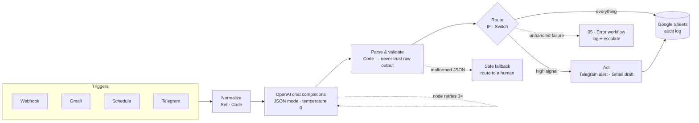

# n8n AI Workflows

[](https://github.com/wanderfool95/n8n-ai-workflows/actions/workflows/validate.yml)
[](https://n8n.io/)
[](https://platform.openai.com/)
[](https://developers.google.com/sheets)
[](https://core.telegram.org/bots/api)
[](workflows)
[](LICENSE)

Five importable n8n workflows that put an LLM where it actually earns its keep:
classifying, extracting and drafting — with the routing, validation and error
handling around it that decides whether an automation survives contact with real data.

> **Reference implementations, extracted from my production projects.** Client-specific
> logic, endpoints and credentials have been replaced with placeholders; the structure,
> prompts and failure handling are what I ship.

Every export is validated in CI: valid JSON, consistent graph, no orphan nodes,
**no credentials, keys, chat IDs or spreadsheet IDs**.

---

## The five workflows

| # | Workflow | Trigger | Does |
| --- | --- | --- | --- |
| 01 | [Lead intake → AI classification](workflows/01-lead-intake-ai-classification.json) | Webhook | Qualifies inbound leads, logs all of them, interrupts a human only for hot ones |
| 02 | [AI email triage](workflows/02-email-triage-ai.json) | Gmail | Categorises inbox mail, drafts replies, alerts on urgent |
| 03 | [RSS → GPT → post draft](workflows/03-rss-content-pipeline.json) | Schedule | Turns new articles into post drafts for human approval |
| 04 | [Invoice OCR → spreadsheet](workflows/04-invoice-ocr-to-sheet.json) | Telegram | Photo of a receipt in, structured expense row out |
| 05 | [Error handling & retry template](workflows/05-error-handling-retry-template.json) | Error / Manual | The retry ladder and error-workflow pattern the other four rely on |

---

## Shared architecture



Four conventions run through all five:

1. **JSON mode, temperature 0.** Every prompt names its exact output keys and the model
   is called with `response_format: {"type": "json_object"}`. Classification is not
   creative writing.
2. **Parsing never trusts the model.** Each Code node wraps `JSON.parse` in try/catch and
   falls back to the *safe* branch — `needs_reply`, not `noise`. A bad parse must degrade
   into human review, never into silence.
3. **Log everything, interrupt rarely.** Every item reaches Google Sheets; only
   high-confidence, high-priority items ping Telegram. An automation that cries wolf gets
   muted, and then it may as well not exist.
4. **Retries are layered.** Node-level `retryOnFail` (3 fast attempts) handles blips; the
   outer loop in workflow 05 handles outages; the Error Trigger catches everything else.

---

## Setup

**Requirements:** n8n 1.x (self-hosted or cloud), an OpenAI API key, and whichever of
Google Sheets / Telegram / Gmail the workflow you want uses.

### 1. Import

In n8n: **Workflows → ⋯ → Import from File**, and pick a file from [`workflows/`](workflows).

Or via CLI on a self-hosted instance:

```bash
n8n import:workflow --input=workflows/01-lead-intake-ai-classification.json
```

### 2. Create the credentials

| Credential type in n8n | Used by | Configuration |
| --- | --- | --- |
| **Header Auth** — name it `OpenAI Header Auth` | 01–04 | Name: `Authorization`, Value: `Bearer sk-…` |
| **Telegram API** | 01, 02, 03, 04, 05 | Bot token from [@BotFather](https://t.me/BotFather) |
| **Google Sheets OAuth2** | 01, 02, 03, 04, 05 | Standard Google OAuth flow |
| **Gmail OAuth2** | 02 | Standard Google OAuth flow |

Every node ships with `"id": "REPLACE_WITH_CREDENTIAL_ID"`. After import, open each node
that shows a credential warning and select your own from the dropdown.

### 3. Fill in the placeholders

Search each imported workflow for `REPLACE_WITH_`:

| Placeholder | Where to find the value |
| --- | --- |
| `REPLACE_WITH_CREDENTIAL_ID` | Selected from the dropdown after import — never typed |
| `REPLACE_WITH_GOOGLE_SHEET_ID` | The long id in `docs.google.com/spreadsheets/d/<ID>/edit` |
| `REPLACE_WITH_TELEGRAM_CHAT_ID` | Message your bot, then open `api.telegram.org/bot<TOKEN>/getUpdates` |

Prefer environment variables? Replace the literal with an expression such as
`{{ $env.TELEGRAM_ALERTS_CHAT_ID }}` and set `N8N_BLOCK_ENV_ACCESS_IN_NODE=false`.
See [`.env.example`](.env.example).

### 4. Point failures at workflow 05

Import `05-error-handling-retry-template.json` first, then in each other workflow open
**Settings → Error Workflow** and select it. Every unhandled failure then lands in one
sheet and one Telegram alert.

> **Why HTTP Request nodes instead of the native OpenAI node?** An HTTP Request node
> imports cleanly into *any* n8n 1.x version, shows the full prompt and parameters in the
> JSON export where a reviewer can read them, and never breaks when the LangChain node
> package changes its parameter shape. Swapping in the native node is a five-minute job if
> you prefer it.

---

## 01 · Lead intake → AI classification → Sheets + Telegram

**What it does.** A `POST` to the webhook (site form, Tally, Typeform, CRM) arrives, gets
normalised, and is classified by GPT into `hot` / `warm` / `cold` along with intent, budget
signal, a summary and a recommended next action. Every lead is appended to Google Sheets.
Only `hot` leads **with confidence ≥ 0.6** trigger a Telegram alert — that second condition
is what keeps the channel worth reading. The caller gets a JSON response either way.

**Nodes**

| Node | Type |
| --- | --- |
| Lead Webhook | Webhook (`POST /lead-intake`, respond via node) |
| Normalize Lead | Edit Fields (Set) |
| Classify Lead | HTTP Request → OpenAI chat completions |
| Parse Classification | Code |
| Log to Google Sheets | Google Sheets (append) |
| Is Hot Lead? | IF (`priority == hot` **and** `confidence >= 0.6`) |
| Alert Sales on Telegram | Telegram |
| Logged Only | No Operation |
| Respond to Sender | Respond to Webhook |

**Sheet tab `Leads`:** Received At · Name · Email · Company · Source · Priority · Intent ·
Budget Signal · Summary · Next Action · Confidence

**Try it**

```bash
curl -X POST https://your-n8n-host/webhook/lead-intake \
  -H 'Content-Type: application/json' \
  -d '{"name":"Ana Silva","email":"ana@acme.io","company":"Acme","source":"website","message":"We need a Telegram bot with GPT for our support team, budget around 5k, starting next month."}'
```

---

## 02 · AI email triage

**What it does.** Polls Gmail for unread inbox mail, extracts sender/subject/body (capped
at 6000 characters so a long thread cannot blow up the token bill), and classifies each
message as `urgent` / `needs_reply` / `fyi` / `noise` with a summary, sentiment and a
complete draft reply in the sender's language. A Switch routes it: urgent pings Telegram,
`needs_reply` becomes a **Gmail draft** — the model never sends mail, a human presses send —
and the rest is logged only. All four branches converge on the same audit sheet.

**Nodes**

| Node | Type |
| --- | --- |
| Gmail Trigger | Gmail Trigger (unread, INBOX) |
| Extract Email Fields | Code (run once per item) |
| Analyse Email | HTTP Request → OpenAI |
| Parse Analysis | Code |
| Route by Category | Switch (`urgent`, `needs_reply`, fallback `low_priority`) |
| Alert on Telegram | Telegram |
| Create Gmail Draft | Gmail (draft, threaded) |
| Low Priority | No Operation |
| Log Triage Result | Google Sheets (append) |

**Sheet tab `Inbox Triage`:** Triaged At · From · Subject · Category · Topic · Sentiment ·
Summary · Confidence · Message ID

---

## 03 · RSS → GPT → post draft

**What it does.** Every 3 hours it reads an RSS feed, deduplicates against
`$getWorkflowStaticData` — so restarting the workflow does not re-post old articles — and
takes at most **3 new items per run** to keep the cost flat and predictable. GPT drafts a
post (hook, body, takeaway, hashtags) and may set `skip: true` when an article is not worth
posting about. Surviving drafts are saved to Sheets with status `draft` and sent to Telegram
for review. **Nothing is published automatically.**

**Nodes**

| Node | Type |
| --- | --- |
| Every 3 Hours | Schedule Trigger |
| Read RSS Feed | RSS Feed Read |
| Filter New Articles | Code (static-data dedupe, capped at 3) |
| Draft Post | HTTP Request → OpenAI (temperature 0.6) |
| Format Draft | Code (run once per item) |
| Worth Posting? | IF (`skip == false`) |
| Save Draft to Sheet | Google Sheets (append) |
| Send Draft for Review | Telegram |
| Skipped | No Operation |

**Sheet tab `Content Drafts`:** Drafted At · Source Title · Source Link · Published At ·
Hook · Post · Hashtags · Status

Change the feed in **Read RSS Feed** and the voice in the system prompt of **Draft Post**.

---

## 04 · Invoice OCR → spreadsheet

**What it does.** Send a photo or PDF of an invoice to a Telegram bot. The file is
downloaded, converted to base64 in a Code node (rather than relying on version-specific
`$binary` expressions), and read by a GPT vision call that returns vendor, invoice number,
dates, currency, subtotal, tax, total, category and a confidence score. An IF gate demands
`total > 0` **and** `confidence ≥ 0.6` before anything reaches the sheet; otherwise the user
is asked for a sharper photo. Silent bad data in a bookkeeping sheet is worse than no data.

**Nodes**

| Node | Type |
| --- | --- |
| Invoice Received | Telegram Trigger |
| Download File | Telegram (resource: file) |
| Image to Base64 | Code (`helpers.getBinaryDataBuffer`) |
| Extract Invoice Data | HTTP Request → OpenAI vision |
| Normalize Invoice | Code (numeric coercion, comma decimals) |
| Extraction Trustworthy? | IF (`total > 0` **and** `confidence >= 0.6`) |
| Append to Expenses | Google Sheets (append) |
| Confirm to User | Telegram |
| Ask for a Better Photo | Telegram |

**Sheet tab `Expenses`:** Extracted At · Vendor · Invoice Number · Issue Date · Due Date ·
Currency · Subtotal · Tax · Total · Category · Confidence

---

## 05 · Error handling & retry template

Two patterns you can paste into any workflow.

**A — retry ladder.** The HTTP node retries **3× fast** at node level (`retryOnFail`,
2 s apart). If it still fails, `onError: continueErrorOutput` sends the item down a second
output into an outer loop: count the attempt in static data, **wait 1 minute**, call again;
after 3 outer attempts, give up and escalate to a human with the status code and message.
Fast retries absorb blips, slow retries absorb outages, and neither hides a real failure.

**B — Error Trigger.** Point any workflow's **Settings → Error Workflow** at this one.
Every unhandled failure is formatted (workflow, failing node, message, execution URL),
appended to a `Failures` sheet, and pushed to Telegram — one place to look after a bad night.

**Nodes**

| Node | Type | Pattern |
| --- | --- | --- |
| Error Trigger | Error Trigger | B |
| Format Error | Code | B |
| Log Failure to Sheet | Google Sheets (append) | B |
| Escalate to Telegram | Telegram | B |
| Run Retry Demo | Manual Trigger | A |
| Call Unreliable API | HTTP Request (`retryOnFail`, error output) | A |
| Reset Attempt Counter | Code | A |
| Count Attempt | Code | A |
| Retry Budget Left? | IF | A |
| Wait 1 Minute | Wait | A |
| Give Up and Alert | Telegram | A |

**Sheet tab `Failures`:** Failed At · Workflow · Node · Message · Execution

The demo endpoint (`httpbin.org/status/200,500,503`) fails randomly, so you can run it a
few times and watch both paths.

---

## Validation

```bash
python scripts/validate_workflows.py
```

Standard library only, no install step. Every export is checked for:

- valid JSON and the top-level keys n8n needs to import it;
- required node fields, unique node names and IDs;
- connections that reference nodes that exist, and no node left unwired;
- at least one trigger and at least one sticky note documenting the flow;
- **no secrets** — OpenAI keys, Telegram bot tokens, JWTs, Google OAuth client IDs, Slack
  tokens or bare spreadsheet IDs;
- every credential id equal to `REPLACE_WITH_CREDENTIAL_ID`, and every placeholder from the
  documented set.

CI runs it on every push and pull request.

---

## Hire me

I build production AI systems: Telegram bots, LLM agents with tool use, and n8n automation
pipelines. Python / FastAPI / aiogram / OpenAI / Claude / Supabase / n8n.

**[→ Hire me on Upwork](https://www.upwork.com/freelancers/~01c8a4f2b80b03bae6)**

See also: **[telegram-ai-assistant-starter](https://github.com/wanderfool95/telegram-ai-assistant-starter)** —
a production-shaped Telegram AI assistant in Python.

---

## License

[MIT](LICENSE)
